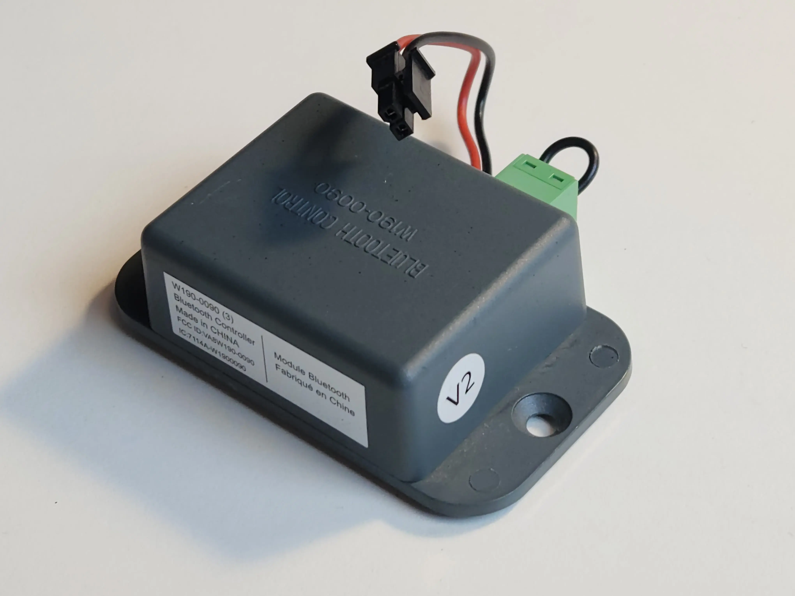
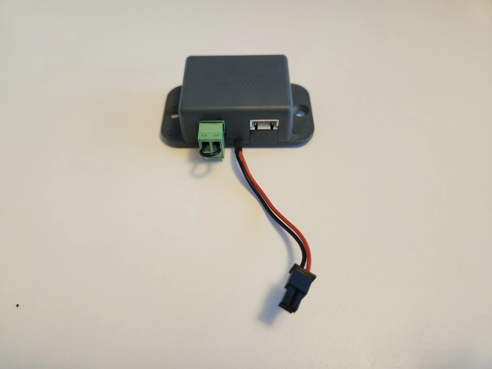

# System Information

This page provides an overview of the interworking of the Napoleon eFIRE
Bluetooth Controller with the SIT ProFlame 2 Integrated Fireplace Controller.

## Napoleon eFIRE Bluetooth Controller



The Napoleon W190-0090 Bluetooth Controller is based on an Iton Technology
BT4GMD-Q25P Bluetooth module.
This Bluetooth module utilizes a Cypress Semiconductor CYW20736A1KML2G
Bluetooth LE SoC.

Refer to [the module's FCC filing](https://fccid.io/VA8W190-0090) for some
additional details.

### Connectors



The module has three external connectors:

1. Green terminal, prepopulated with a jumper cable, referred to in the FCC
   filing as a "Jumper for user options"
2. Two conductor lead for the an optional LED Controller (Napoleon Model Number W190-0125)
3. A white 2.54mm pitch 4-pin XH series header for 3.3V power and UART from the
   SIT ProFlame 2 IFC

The function of the green terminal is currently unknown.

The pinout for the XH header, when viewed in the orientation as seen on the above
picture, is as follows:

`3V3 | RX | TX | GND`

The GND pin is the one that is closes to the edge of the case and has the typical
XH Pin 1 marking arrow on the side of the housing of the plug end of the connection.

## SIT ProFlame 2 IFC

The SIT ProFlame 2 Integrated Fireplace Control is a controller commonly found
in gas fireplaces of various brands.

SIT provides it's own
[Wi-Fi Dongle](https://proflame.sitgroup.it/eng/proflame-connectivity/wi-fi-dongle)
for the ProFlame 2.

The [SIT ProFlame Wi-Fi Dongle User Manual](https://proflame.sitgroup.it/media/96/t-file/Proflame-WIFI-Dongle-Use-and-Installation-Instructions.pdf)
details the hardware requirements for the use of the Wi-Fi dongle.
The website also mentions the need to use a ProFlame 2 IFC with the schematics
on the case printed in green.

My assumption is the significance of this is the ability of this updated IFC in
conjunction with the new "Wi-Fi Enabled" remote (SIT Part 0.584.080) to
synchronize state between the remote and Wi-Fi dongle overcoming the
limitations the Napoleon implementation currently has.

## SIT ProFlame 2 UART Communication

The following information on the ProFlame 2 UART communication has been gathered
by sniffing the serial traffic on the port using a little rig I built and the
[slsnif](https://github.com/aeruder/slsnif) tool.

```{figure} _static/w190-0090-uart-sniffer-setup.webp
:width: 50%
:align: center

Custom cable that breaks out the individual connections to be intercepted by
common USB to serial adapters.
```

The IFCs serial configuration is 9600–8-N-1.

The binary protocol seems to use a fixed length of 6 bytes per message.
The Napoleon controller polls the IFC every second for state information and
sends commands to the IFC as needed.

The IFC does not generate any output unless requested through a message.

### Message format

```{packetdiag}
{
  colwidth = 8

  * Message Type [len=8]
  * Payload [len=24]
  * Register [len=8]
  * Checksum (XOR) [len=8]
}
```

#### Message Type

Four message types can be observed:

1. `0x5D` Set value request
2. `0x5E` Get value request
3. `0xAD` Set value response
4. `0XAE` Get value response

Request messages originate on the controller, and responses originate
on the IFC.

#### Payload

The payload for get requests is `0x00 0x00 0x00`.

For set requests it differs by register. The `0x17` and `0x18`
registers directly correlate to their Bluetooth protocol counterparts and use
the same payload format as described below.

#### Register

What I titled register is what I assume to be an addressing mechanism for
certain function groups. The eFIRE controller uses three different registers:

1. `0x16`: This seems to relate to requesting control over the fireplace
2. `0x17`: This directly correlates to the <project:#ifc-cmd1> command in the
   eFIRE Bluetooth Protocol
3. `0x18`: This directly correlates to the <project:#ifc-cmd2> command in the
   eFIRE Bluetooth Protocol

### The 0x16 register

The behaviour observed on the 0x16 register suggests it is responsible to broker
control over the IFC.

The eFIRE Controller requests control using this message:

`0x5D 0xC1 0xA0 0x00 0x16 0x2A`

To which the IFC will reply

`0xAD 0xC1 0xA0 0x00 0x16 0xDA`

if control is granted.

Control is denied if the RF remote is in use. In this case the IFC will reply

`0xAD 0x00 0x00 0x00 0x16 0xBB`

The 0x16 register can also be queried using:

`0x5E 0x00 0x00 0x00 0x16 0x48`

If we have control the IFC will reply

`0xAE 0xC1 0xA0 0x00 0x16 0xD9`

if we do not have control the IFC will reply:

`0xAE 0x00 0x00 0x00 0x16 0xB8`

### Communication between eFIRE and ProFlame 2

In normal operation the eFIRE Controller requests the current state of both the
`0x17` and `0x18` register every second with the following sequence:

```
CTRL: 0x5E 0x00 0x00 0x00 0x17 0x49
 IFC: 0xAE 0X00 0x61 0x00 0x17 0xD8
CTRL: 0x5E 0x00 0x00 0x00 0x18 0x46
 IFC: 0xAE 0x00 0x00 0x00 0x18 0xB6
```

In this case the night light level is set to 6 and the fireplace mode is "on"
in register `0x17`, however, since no flame height is set in register `0x18`,
the fireplace is not actually operating the burner in this state.

When a setting in either of those registers is changed through the app the
controller will issues the following sequence of messages and revert to it's
polling loop immediately after:

```
CTRL: 0x5D 0xC1 0xA0 0x00 0x16 0x2A  # requesting control
 IFC: 0xAD 0xC1 0xA0 0x00 0x16 0xDA  # we have control
CTRL: 0x5E 0x00 0x00 0x00 0x16 0x48  # checking control
 IFC: 0xAE 0xC1 0xA0 0x00 0x16 0xD9  # we have control
CTRL: 0x5E 0x00 0x00 0x00 0x17 0x49  # get 0x17 state
 IFC: 0xAE 0X00 0x01 0x00 0x17 0xB8  # 0x17 state
CTRL: 0x5E 0x00 0x00 0x00 0x18 0x46  # get 0x18 state
 IFC: 0xAE 0x00 0x00 0x00 0x18 0xB6  # 0x18 state
CTRL: 0x5D 0x00 0x01 0x00 0x17 0x4B  # set 0x17 state
 IFC: 0xAD 0X00 0x01 0x00 0x17 0xBB  # 0x17 state
CTRL: 0x5D 0x00 0x80 0x00 0x18 0xC5  # set 0x18 state (Split Flow On)
 IFC: 0xAD 0x00 0x80 0x00 0x18 0x35  # 0x18 state
```

## Limitations

The ProFlame 2 IFC currently does not report valid state information when
ontrol is taken over using the RF remote control.

Querying the `0x17` and `0x18` registers while the fireplace is controlled by
the RF remote will yield stale values at best and random values at worst.

As soon as the RF remote control is used to control the fireplace we can no
longer gain control using the `0x16` register and the fireplace will respond to
requests for control as outlined above.

Control can only be regained using the `0x16` register when the fireplace is
turned off using the RF remote.

Napoleon mentions this in their documentation by stating that the RF remote
always takes precedence over the eFIRE app.
Screenshots on the Google Play Store suggest the app is supposed to detect when
this happens and block input on the app by showing an overlay.
This is not the case on my fireplace.
